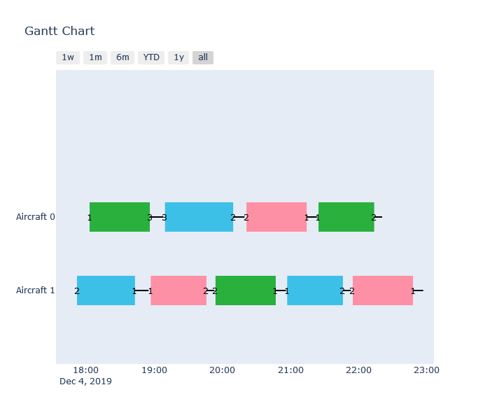

# Aircraft Scheduling

This is a Proof of Concept for an ASP formulation of the Aircraft Scheduling problem.

## Getting Started

These instructions will get you a copy of the project up and running on
your local machine for development and testing purposes. See deployment
for notes on how to deploy the project on a live system.

### Prerequisites

Which things you need to install the software and how to install them


* [Python3](https://www.python.org/downloads/)
* [Pip](https://pip.pypa.io/en/stable/installing/)          Already included in the latest python versions

### Installing

First, you need to clone this repository

```bash
git clone https://github.com/ingambe/Aircraft_Scheduling.git
cd Aircraft_Scheduling
```

Optional (but recommanded):
You can create a virtual environement in order to keep the dependencies separated from your own python environement

```bash
pip install virtualenv
virtualenv venv
source venv/Scripts/activate
```

And finally install all the dependencies

```bash
pip install -r requirements.txt
```

## Generate instances

The script file [route_gen.py](https://github.com/ingambe/Aircraft_Scheduling/blob/master/instance_generator/route_gen.py) allows you to generate instances.
If you run it using `--default`, it will use the [defaults one](https://github.com/ingambe/Aircraft_Scheduling/blob/master/instance_generator/default_parameters.py).
The `--gannt` argument generate and display a gannt of the instances:
<p align="center"> 

</p>

## Solve an instance

The [main script](https://github.com/ingambe/Aircraft_Scheduling/blob/master/main.py) file at the root of the project allows to solve an instance and test that the outputed solution is legal.

```bash
usage: main.py [-h] [--instance INSTANCE] [--encoding ENCODING]
               [--output_file OUTPUT_FILE] [-n N] [-q]

Generate the solution and test it to ensure it is correct

optional arguments:
  -h, --help            show this help message and exit
  --instance INSTANCE   the path to the instance
  --encoding ENCODING   the path to the encoding
  --output_file OUTPUT_FILE
                        the path to the ouput file
  -n N                  number of solution to get (default = 1)
  -q                    quiet mode, doesn't print the solution
```

The folder *encoding* folder contains every encoding you can use and test.
The folder *instances* folder contains every instances to solve.

## Running the tests

The instance generator is tested here: [unit_test.py](https://github.com/ingambe/Aircraft_Scheduling/blob/master/instance_generator/test/unit_test.py).
You can run the unit test using *pytest*.

## Authors

-  **Pierre Tassel**
-  **Martin Gebser**

## License

MIT License
