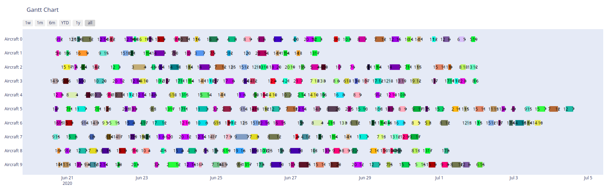

# Aircraft Scheduling [](https://travis-ci.com/ingambe/Aircraft_Scheduling)

This is a Proof of Concept for an ASP formulation of the Aircraft Scheduling problem.

## Getting Started

These instructions will get you a copy of the project up and running on
your local machine for development and testing purposes. See deployment
for notes on how to deploy the project on a live system.

### Prerequisites

Which things you need to install the software and how to install them


* [Python3](https://www.python.org/downloads/)
* [Conda](https://docs.conda.io/projects/conda/en/latest/user-guide/install/)          **Recommended** otherwise you will need to install Python enabled Clingo yourself (see https://github.com/potassco/clingo/releases/)
* [Pip](https://pip.pypa.io/en/stable/installing/)          Already included in the latest python versions

### Installing

First, you need to clone this repository

```bash
git clone https://github.com/ingambe/Aircraft_Scheduling.git
cd Aircraft_Scheduling
```

Optional (but recommended):
You can create a virtual environment in order to keep the dependencies separated from your own python environment.
You can use either Conda or Pip, but it is easier to use Conda in order to install Clingo with Python include.

**For Conda users (Recommended):**

```bash
conda create --name aircraft_schedule --file environment.yml
conda activate aircraft_schedule
```

**For Pip users:**
After having installer Clingo with Python included.

```bash
pip install virtualenv
virtualenv aircraft_schedule
source aircraft_schedule/Scripts/activate
```

And finally install all the dependencies:

```bash
pip install -r requirements.txt
```

## Generate instances

The script file [route_gen.py](https://github.com/ingambe/Aircraft_Scheduling/blob/master/instance_generator/route_gen.py) allows you to generate instances.
If you run it using `--default`, it will use the [defaults one](https://github.com/ingambe/Aircraft_Scheduling/blob/master/instance_generator/default_parameters.py).
The `--gantt` argument generate and display a gannt of the instances:
<p align="center"> 

</p>

## Solve an instance

The [main script](https://github.com/ingambe/Aircraft_Scheduling/blob/master/main.py) file at the root of the project allows to solve an instance and test that the outputted solution is legal.
You can also see the gantt of your solution if you want it.

```bash
usage: main.py [-h] [--input INPUT] [--instance INSTANCE]
               [--output_file OUTPUT_FILE] [--gantt]

Generate the solution and test it to ensure it is correct

optional arguments:
  -h, --help            show this help message and exit
  --encoding INPUT      the path to the encoding you want to use to solve the instance
  --instance INSTANCE   the path to the instance to solve 
  --output_file OUTPUT_FILE
                        the path to the ouput solution file
  --gantt               output the gannt of the solution
  --parallel            run the search in parallel on a given number of cores
```

The folder *encoding* folder contains every encoding you can use and test.
The folder *instances* folder contains every instances to solve.

Here is an example of the gannt of a solved instance:
<p align="center"> 

</p>

## Available encoding

There is two main type of available encoding:
- **One shot**: the "classical" approach which consist of ground + solve the instance.
- **Multi Shot One Hour**: where we incrementally add new predicate to the solver, we run it for one hour.
- **Multi Shot**: the multi-shot wich stops if he don't improve is founded solution after 3 iterations.
- **Parallel**: the exact same encoding as *Multi Shot* except that the benchmark script recognize him as something to launch in parallel mode.

If you plain to use the multi shot formulation in your project, you may need to fine tune the hyper-parameters of the solver such as the incremental step (which represent the added extra on-ground time in second at each iteration), the number of iteration without improvement before to stop and maximum allowed time to the solver in order to find a solution.

## Running the tests

The instance generator is tested here: [unit_test.py](https://github.com/ingambe/Aircraft_Scheduling/blob/master/instance_generator/test/unit_test.py).
You can run the unit test using *pytest*.
The test coverage his far from optimal unfortunately, a contribution to this aspect is welcomed.

## Authors

-  **Pierre Tassel**
-  **Martin Gebser**
-  **Mohamed Rbaia**

## License

MIT License
